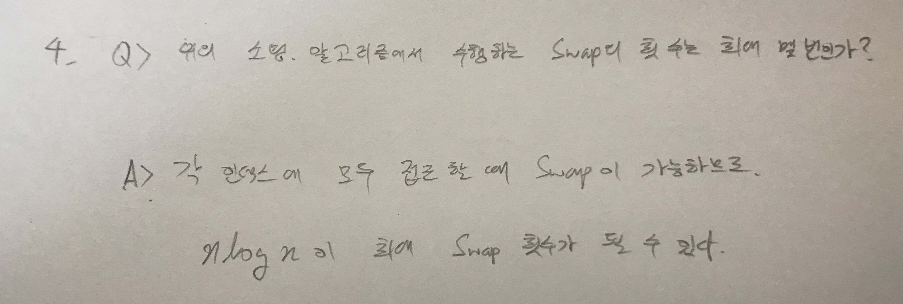

# 재귀

> 함께 학습하고 고민하고 설명하며 작은 부분 하나라도 '내 것'으로 만들어보세요. 😁


## 2번 - Merge Sort Time Complexity Proof

.jpg)


.jpg)


## 4번 



## 6번

저희 조끼리 해결해보려다 포기하고 따라쳤습니다...

```python
def recursion(node, ancestors, generations):
    if node in tree:
        for i, child in enumerate(tree[node], start = 1):
            recursion(child, ancestors + [node], generations + [i])
    else:
        ancestors += [node]
        rtn = f'[{str(ancestors[0]).zfill(3)}]' if not printed else '     '

        for i , ancestor in enumerate(ancestors[1:], start = 1):
            if ancestor in printed:
                rtn +='   |        '
            else:
                sibling_count = len(tree[ancestors[i-1]])
                sibling_rank = generations[i]
                number = str(ancestor).zfill(3)

                if sibling_count == 1:
                    rtn += f' ----- [{number}]'
                elif sibling_rank == 1:
                    rtn += f' --+-- [{number}]'
                elif sibling_count ==sibling_rank:
                    rtn += f'   L-- [{number}]'
                else:
                    rtn += f'   +-- [{number}]'

                printed.add(ancestor)
        print(rtn)


tree = {}
edges = list(map(int, input().split()))
# 30 54 30 2 30 45 54 1 54 3 45 123 1 101 1 102 3 103

for i in range(0, len(edges)-1, 2):
    tree[edges[i]] = tree.get(edges[i],[]) + [edges[i + 1]]

printed = set()
recursion(edges[0], [], [1])
```

