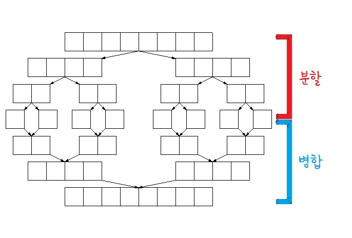
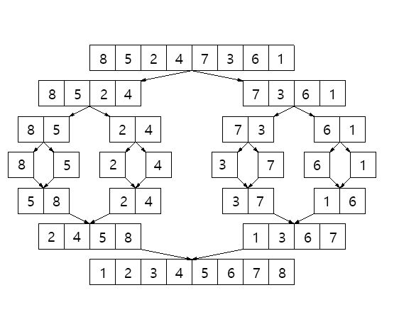

# 재귀


## 2번 - Merge Sort Time Complexity Proof


- 시간 복잡도: O(n log n)

- 진행과정
  

  

- 구현 코드

```python
def split(arr:list):  # 리스트를 분할정복하는 함수
    if len(arr) < 2: return arr
    l = split(arr[:len(arr)//2])
    r = split(arr[len(arr)//2:])
    return merge(l, r)


def merge(le, ri):
    ans = []
    x1 = x2 = 0

    while len(le) != x1 and len(ri) != x2:  # 두 리스트의 크기를 비교하며 ans에 push
        if le[x1] <= ri[x2]:  # le가 더 작거나 같은 경우
            ans.append(le[x1])
            x1 += 1
        else:  # ri가 더 작은 경우
            ans.append(ri[x2])
            x2 += 1
    
    if len(le) > x1:  # le가 아직 ans에 다 추가가 안 된 경우
        ans.extend(le[x1:])
    
    if len(ri) > x2:  # ri가 아직 ans에 다 추가가 안 된 경우
        ans.extend(ri[x2:])
    
    return ans


print(split([8, 1, 0, 9, 4, 2, 7, 6, 3, 10, 5]))
"[0, 1, 2, 3, 3, 4, 5, 6, 7, 8, 9, 10]"
```


## 4번


- n * log(n)번


## 6번


```python
def tree(arr, root):
    ans = []
    rec = set()  # 전체 방문 기록

    def dfs(n, v):  # 현재 노드, 방문 기록
        if not arr.get(n):  # base case
            w = ''
            for i in v:
                if i in rec:  # 전체 방문 기록에 있는 경우(노드를 표시하면 안됨 => 공백으로 표시)
                    if w and w[-1] == ' ':  # w의 마지막 칸이 공백인 경우(공백 3칸 더 만들어야 함)
                        w += ' ' * 3
                    w += ' ' * 7
                    continue
                
                rec.add(i)  # 전체 방문 기록에 추가
                if i == root:  # 루트 노드인 경우
                    w += f'[{i}]'

                elif i in arr[root]:  # 루트의 자식인 경우
                    if i == arr[root][0]:
                        w += f'-----[{i}]'
                    elif i == arr[root][-1]:
                        w += f'L--[{i}]'
                    else:
                        w += f'+--[{i}]'
                elif w and w[-1] == ' ':  # 마지막 칸이 공백인 경우
                    w += f'---[{i}]'
                else:  # 마지막 칸이 공백이 아닌 경우
                    w += f'-----[{i}]'
                    
            ans.append(w)  # w를 추가
            return
        
        for i in arr[n]:  # 해당 노드의 자식들 반복
            v.append(i)
            dfs(i, v)  # 백트래킹
            v.pop()


    dfs('030', ['030'])  # dfs 시작은 루트노드
    print(*ans, sep='\n')


input = {'030': ['054', '002', '045'], '054': ['001', '004'], '045': ['123'], '123': ['124', '125']}
tree(input, '030')
"""
[030]-----[054]-----[001]
                 ---[004]
       +--[002]
       L--[045]-----[123]-----[124]
                           ---[125]
"""
```

