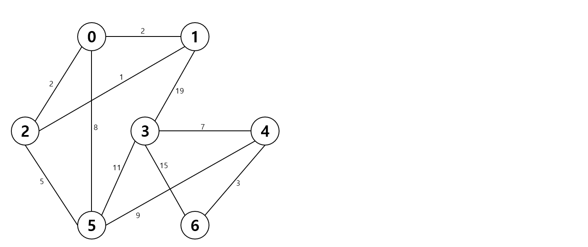

# Kruskal

위의 그래프에서 **크루스칼** 알고리즘을 활용해 MST를 구성하시오.

| V1   | V2   | 가중치 | 순서          |
| ---- | ---- | ------ | ------------- |
| 1    | 2    | 1      | 1             |
| 0    | 1    | 2      | 2             |
| 0    | 2    | 2      | pass          |
| 4    | 6    | 3      | 3             |
| 2    | 5    | 5      | 4             |
| 3    | 4    | 7      | 5             |
| 0    | 5    | 8      | pass          |
| 4    | 5    | 9      | 6 (N-1 => 끝) |
| 3    | 5    | 11     |               |
| 3    | 6    | 15     |               |
| 1    | 3    | 19     |               |

