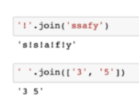
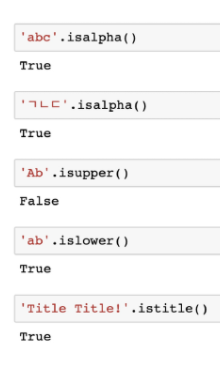

# ★Python 총정리★


[TOC]

# 1. 데이터

##### 


### 


**매우중요! 줄 바꿈할 때는 print()를 사용하기도 한다. 대신 들여쓰기 확인


# 2. 컨테이너


## 2.1 시퀀스

### 2.1.1 list


###### .append(x) : 리스트에 값을 추가 

###### .extend(iterable) : 리스트에 iterable 항목 추가


###### .insert(i, x) 


###### .remove(x) : 리스트에서 값이 x인 것 삭제 

###### .pop(i) 


###### .clear() : 모든 항목을 삭제함 

###### .index(x) : x 값을 찾아 해당 index 값을 반환 

###### .count(x) : 원하는 값의 개수를 반환 

###### .sort()와 sorted 함수의 차이점은? .sort()는 원본 리스트를 정렬하고 None 반환. sorted함수는 원본 변경 없음.


###### .map(function, iterable)


list(map(int, input().split())) 에서 '1 3 5 7'이 들어왔다면, 이걸 int형식으로 변환하여 list화 시킴.


###### .filter(function, iterable)


###### .zip(*iterables)

2차원 배열 사용시 for i in zip(*iterables) 사용!! 


###### **리스트 복사 


###### *얕은 복사1


###### *얕은 복사2


###### *얕은 복사 주의사항


###### *깊은 복사


###### *list comprehension

 <-1~3 중 짝수 list


### 2.1.2 tuple


### 2.1.3 range


### 2.1.4 문자열


###### .find(x) : x의 첫번째 위치를 반환. 없으면, -1을 반환함.

###### .index(x) : x의 첫번째 위치를 반환. 없으면, 오류 발생

###### .replace(old, new[,count]) 

###### .strip([chars]) : 양쪽 제거.lstrip([chars]) : 왼쪽 제거 .rstrip([chars]) : 오른쪽 제거


###### .split([chars]) : 문자열을 특정한 단위로 나눠 리스트로 반환


###### 'separater'.join([iterable]) : 반복가능한 컨테이너 요소들을 separater(구분자)로 합쳐 문자열 반환



###### 이외에 




### 2.1.5 slicing, len, count는 위 4개(list, tuple, range, 문자열)만 가능


### 2.1.6 연산자


## 2.2 비시퀀스

### 2.2.1 세트 


###### .add(element) 

###### .update(*others) 

###### .remove(element) 

###### .discard(element)

###### .pop() 

### 2.2.2 딕셔너리


###### .get(key[,default])

###### .pop(key[,default])


###### .update() 

###### *딕셔너리 순회 


###### *dictionary comprehension


## 2.3 컨테이너 간 형변환 및 분류


# 3. 제어문


## 3.1 조건문


## 3.2 반복문


### 3.2.1 while문


### 3.2.2 for문


###### break  

###### continue 


###### for-else 


###### pass와 continue의 차이 

# 4. 함수

```python
def 함수명(x, y):
    return x + y

print(함수명(2,3)) = 5
```


## 4.1 인자

### 4.1.1 위치 인자

### 


### 4.1.2 키워드 인자


add(x=2, 5) --> 불가

add(2, y=5) --> 가능

### 4.1.3 가변 인자


### 4.1.4 가변 키워드 인자


### 4.1.5 함수 정의 주의 사항


## 4.2 함수 스코프


### 4.2.1 LEGB


## 4.3 재귀함수(recursive function)


*변수 사용 적게 가능. but, 메모리 사용 많음, 속도가 느림.

### 4.3.1 팩토리얼


### 4.3.2 피보나치


## 4.4 예외(Exception)


### 4.4.1 에러


### 4.4.2 예외 처리


###### raise 

###### assert


# 5. OOP


isinstance(10, int)

10이 class 'int'로 만들어졌냐? T

isinstance(10, object)

10이 class 'object'에 포함되어있냐? T

isinstance(0, (bool, int, complex)) -> 하나라도 일치하면 T임

0이 bool~complex 안에 포함되어있냐? T


### 5.1.1 속성


### 5.1.2 메서드


### 5.1.3 self


### 5.1.4 생성자


### 5.1.5 소멸자


### 5.1.6 매직 메서드


### 5.1.7 인스턴스 변수


각각의 instance는 독립적이다 -> 항상 특정 instance에 묶여있음. -> 오로지 해당 객체에만 영향

(instance1 변경 시, instance2에 영향 X)

instance는 class메서드와 static메서드에 접근 가능.

class에 저장되지 않고, class에서 생성된 개별 객체에 저장


### 5.1.8 클래스 변수


c2.pi = 3.141592로 바꾸면

print(c2.pi)는 3.141592로 바뀌고 print(c1.pi)는 그대로 3.14

### 5.1.9 인스턴스와 클래스 간의 이름 공간


## 5.2 메서드

### 5.2.1 인스턴스 메서드


instance_method 호출 시, 반드시 자동으로 self가 오든, self가 있어야함.

Class가 instance_method를 부르려면, Class명.instance_method(instance명) 으로 부른다.

MyClass.instance_method() -> TypeError 발생. (self 값을 넣을 방법 없음.)

instance가 class에 접근은 가능하여, class상태를 수정할 수는 있으나 절대 하면 안됨.

### 5.2.2 클래스 메서드


cls 인자에만 접근 가능하여, instance 상태 수정 불가능.

### 5.2.3 스태틱 메서드


임의 개수의 매개 변수를 받을 수는 있음.

self와 cls의 매개 변수는 사용 불가능.

### 5.2.4 메서드 정리


## 5.3 상속

상속하는 이유는 상위클래스의 메서드를 가져와야 할때, 부모 클래스와의 공통점이 있을때


### 5.3.1 issubclass


### 5.3.2 super()


### 5.3.3 메서드 오버라이딩


### 5.4 상속 정리


