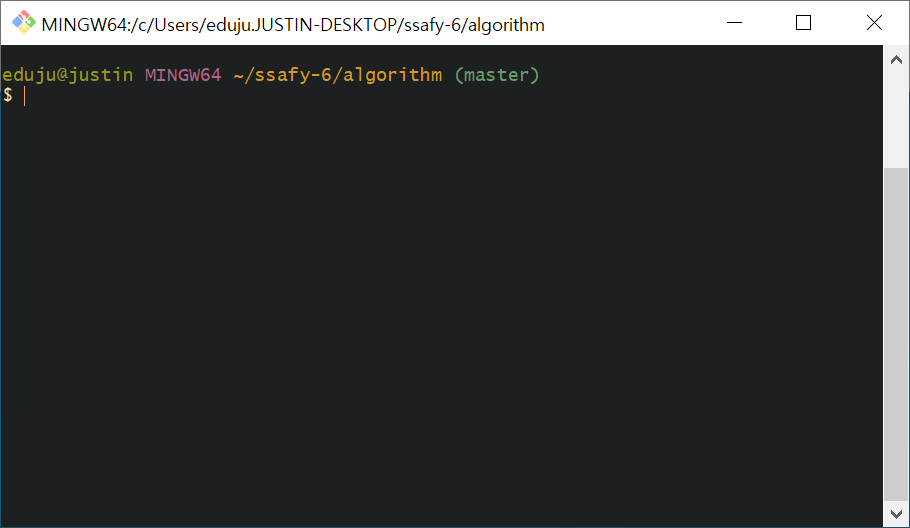
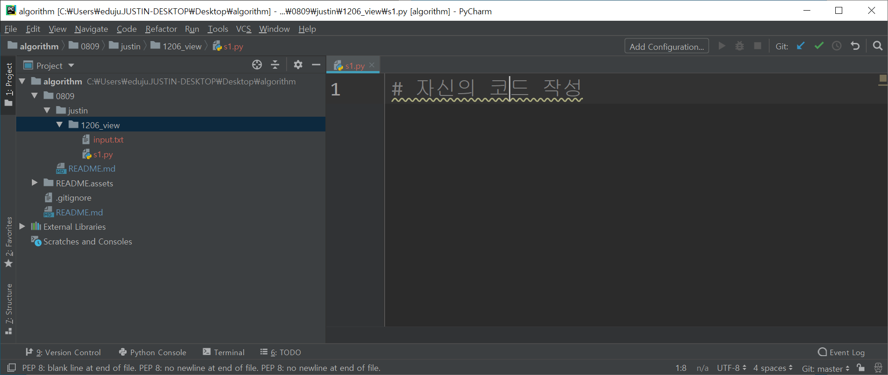
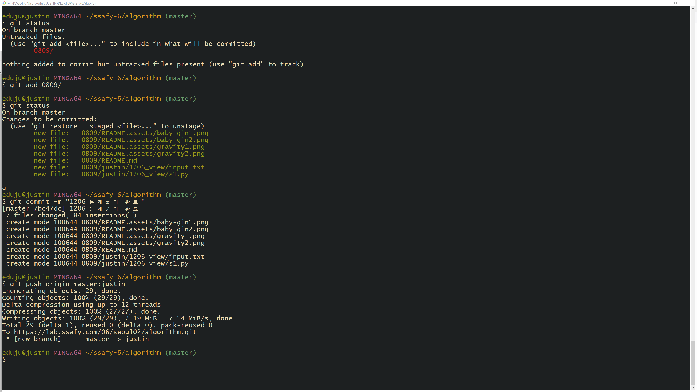
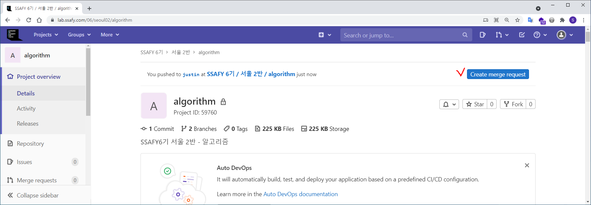
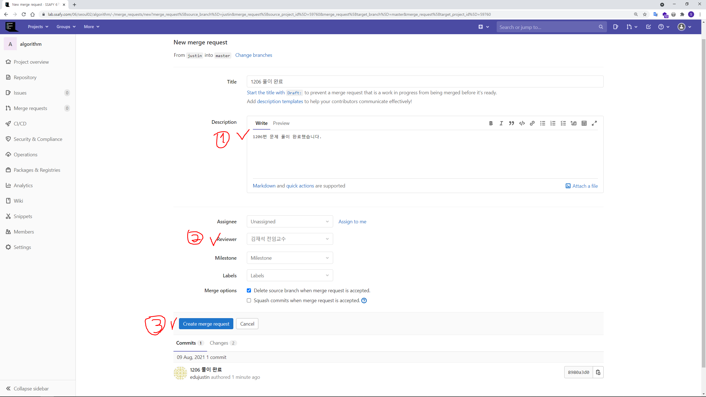
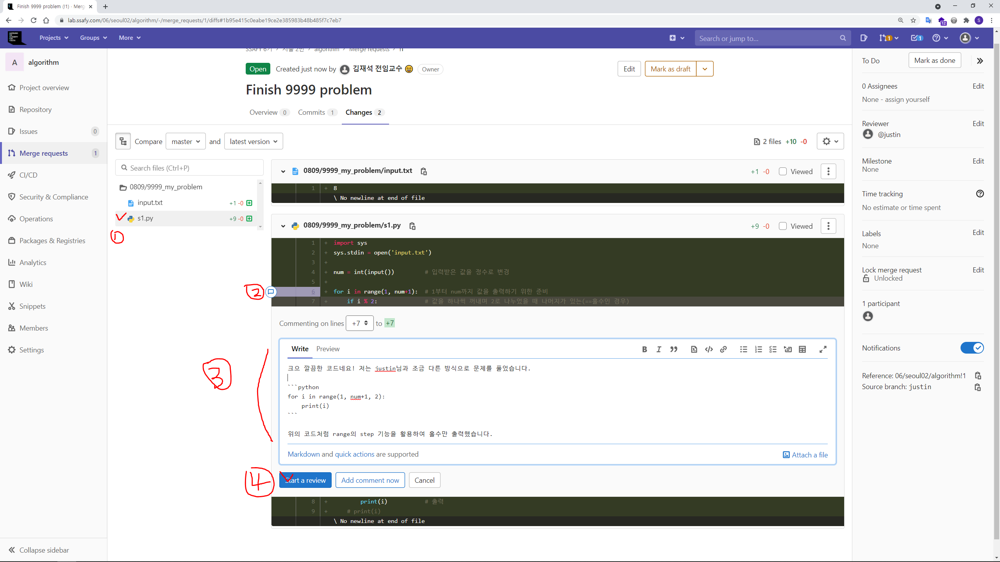
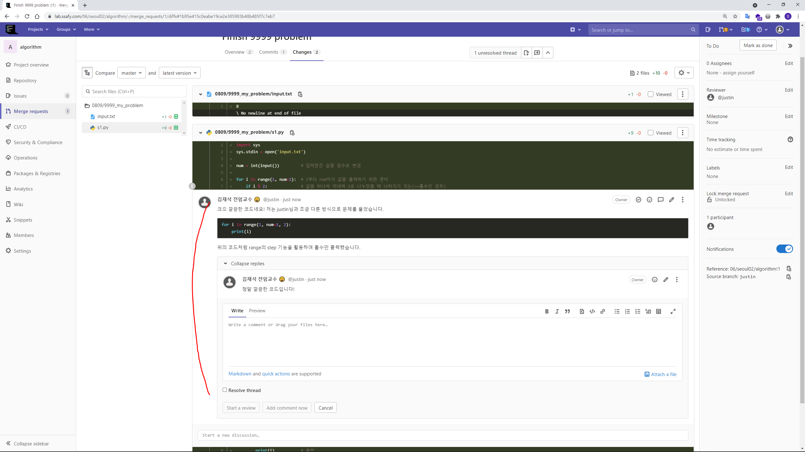
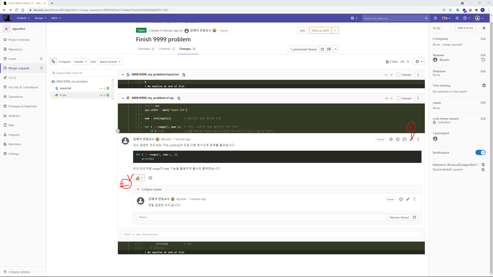
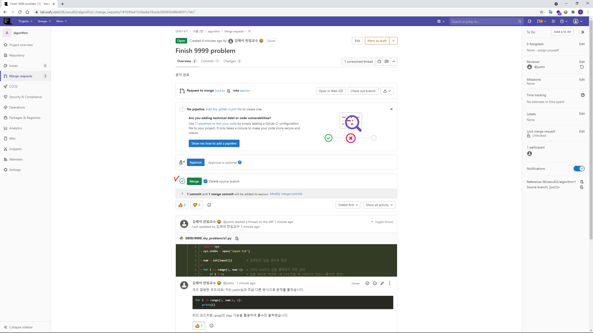

[[_TOC_]]

# Happy Alogorithm 🎵

## 1️⃣ Ground Rules 

1. 우리는 같이 성장합니다. 👏
   - 다른 사람의 발표(행동)에 반응하며 아낌없이 감탄해주세요.
   - 이모지 / 비언어적 표현(끄덕끄덕) / 채팅 등 다양한 방식으로 참여할 수 있어요. 
2. 우리는 생각을 코드로 표현합니다. 🗣 
   - 개인의 생각에 정답은 없어요. 코드는 내 생각을 표현하는 도구 일 뿐입니다. 
   - 생각의 표현을 부끄러워 하지마세요. 더 많이 표현할 수록 더 많이 배울 수 있어요. 
3. 우리는 기계가 아니라 사람입니다. 🤖 
   - 기계도 계속 일하면 고장나요. 
   - 열심히 하는 것만큼 잘 쉬는 것도 중요해요.


## 2️⃣ Daily Schedule

> 일정은 상황에 따라 변경 될 수 있습니다.

| 요일           | 상세 내용               | HW   | 팀 코드 리뷰 |
| -------------- | ----------------------- | ---- | ------------ |
| 월요일, 수요일 | 라이브 복습 & 연습 문제 | O    | X            |
| 화요일, 목요일 | 실습 문제               | O    | O            |
| 금요일         | 실습 문제 & 추가 문제   | O    | O            |

- 대체 공휴일 등의 일정으로 인해 금요일도 월요일/수요일과 같은 방식으로 운영되는 날이 있습니다.


## 3️⃣ Team Code Review System

### 3.1. 코드 리뷰

> "코드 리뷰의 목표는 모두의 노력을 통해 전체 시스템의 코드 베이스가 **점진적으로 개선**되는 것입니다."

코드 리뷰를 통해 이런 것들도 해낼 수 있어요.

- **효과적이고, 이해하기 쉽고, 유지보수가 쉽고, 안전한 코드**로 개선 가능해요.
- **버그, 로직 에러, 혹은 작성자가 발견하지 못한 엣지 케이스** 등을 발견할 수 있어요.
- 코드 리뷰를 통해 **서로 지식을 공유하고 의견을 주고 받으면서 자연스럽게 "멘토링"**도 가능해요.


**[역할과 책임 그리고 약속](https://docs.gitlab.com/ee/development/code_review.html#everyone)**

- **친절하세요. **
  - 어쩌면 이 세상에서 가장 쉬운 일입니다.
- **프로그래밍에서 많은 결정은 그저 의견에 불과합니다.** 
  - 장단점을 잘 비교하고, 무엇을 더 원하는지 얘기해서 최대한 빠르게 결론에 도달합시다.
- **요구하지 말고 질문하세요.**
  - 질문은 우리에게 새로운 시야를 선물합니다.
- **모르겠으면 더 명확하게 알려달라고 하세요**.
  - 모르는데 아는 척 하는 것만큼 발전을 저해하는 일은 없습니다.
  - 모르면 무조건 질문하세요. 그 자체가 서로에게 배움입니다.
- **모든 사람이 똑똑하고 좋은 의미를 잘 전달한다고 가정하세요.**
  - 상대방을 의심하기 보단 그들의 능력을 믿어주세요.
- **분명하고 명확하게 말하세요.**
  - 내가 생각하는 바를 명확하게 표현하는 것은 너무도 중요합니다.
- **겸손해지세요**. 
  - 모르겠으면 같이 찾아보자고 하면 됩니다.
- **과장하지 마세요.** 
  - "항상", "절대", "언제나" 등의 단어는 피합시다.
- **비꼬지 마세요.**
  - 우리는 그저 같이 성장하기 위한 공동의 목표를 달성하기 위해 모인 사람들입니다.

- **감탄하세요.**
  - 세상은 놀라움을 느끼는 만큼 그대에게 배움이라는 큰 선물을 가져다 줄거에요.


### 3.2. 코드 리뷰 진행
> 아래의 시간표는 화/목에 해당하며 상황에 따라 변경될 수 있습니다.

| 시간          | 내용                                               |
| ------------- | -------------------------------------------------- |
| 09:00 ~ 10:00 | 조 선정 + 개별 문제 풀이 (실습 문제)               |
| 10:00 ~ 11:00 | 개별 문제 풀이 (실습 문제) -> 최종 PR 완료         |
| 11:00 ~ 12:00 | 1차 조별 코드 리뷰 & 발표 준비(**완성 코드 준비**) |
| 12:00 ~ 13:00 | 점심                                               |
| 13:00 ~ 14:00 | 1차 조별 발표 (조별 최종 코드 노션 제출 후 발표)   |
| 14:00 ~ 15:00 | 개별 문제 풀이 (실습 문제 + HWS)                   |
| 15:00 ~ 16:00 | 개별 문제 풀이 (실습 문제 + HWS) -> 최종 PR 완료   |
| 16:00 ~ 17:00 | 2차 조별 코드 리뷰 & 발표 준비(**완성 코드 준비**) |
| 17:00 ~ 18:00 | 2차 조별 발표 (조별 최종 코드 노션 제출 후 발표)   |


**팀 구성 방식**

- 한 조는 4 ~ 5인으로 구성
- 화요일 9시에 팀을 구성
- 랜덤 방식으로 선정
- 1주 단위로 변경


**발표 코드 준비 **

- 조에서 작성한 최종 코드는 상세한 주석과 함께 노션에 먼저 업로드
  - 단, 실제 발표를 할 때는 발표자가 자신의 pycharm에 코드를 올려놓고 실행하며 진행

- 팀 별 코드는 노션에도 같이 업로드 


**발표자 선정 방식**

- 발표자는 각 조에서 매 코드 리뷰 때마다 한명씩 선정
- 선정 기준은 자유롭게 선택하되 가급적 모든 인원이 발표할 수 있도록 구성
- 매 발표는 '조'를 랜덤하게 선택하며 해당 조의 담당 발표자가 발표
  - 최대한 많은 인원이 발표할 수 있도록 중복으로 선택 시 다시 진행


**발표 방식**

1. 발표 전 조에서 결정된 최종 코드는 노션에 업로드

2. 담당 교수님이 1~6개 조에서 랜덤 선택

3. 해당 조의 발표자는 본인의 조에서 결정한 완성 코드 발표

4. 발표 과정에서 아래와 같은 도구를 활용 가능
   - 상세한 주석 활용
   - `print` 활용
   - 디버거 활용
   - 시각화 자료 활용


### 3.3. 코드 리뷰 방법 
> 의견이 맞지 않을 때는 서로 한 발짝 양보해요 💚


**어떤 방식으로 코드 리뷰를 진행해야 하나요?** 

1. 문제 접근 방식을 얘기해보고
   - 어떤 부분에서 어떤 유형의 문제라고 생각했고
   - 어떤 방식으로 문제를 풀어가면 되겠다고 판단했는지

2. 문제를 풀면서 어려웠던 점이 무엇인지 얘기해보고
   - 문제 자체의 이해
   - 입력 & 출력 
   - 코드 구현 방식
   - 문제에서 요구하는 개념

3. 다른 사람의 코드를 보며 궁금한 부분을 질문하거나 '감탄'하며
   - "6~8번 라인의 코드가 의미하는게 뭔가요??"
   - "8번째 줄 코드를 저도 비슷한 방식으로 구현했는데 왜 원하는 출력 결과가 안나왔을까요?"
   - "와!! 14~16번째 줄의 의미를 머리로 생각만하고 코드로 어떻게 구현해야 하는지 고민하고 있었는데.. 너무 멋있습니다!"
4. 질문에 대한 답을 토대로 조에서 발표할 최종 코드를 완성하고 노션에 업로드하고
5. 최종적으로 발표 할 코드는 pycharm에서 볼 수 있도록 준비합니다.


**다른 사람의 코드에서 구체적으로 무엇을 봐야 하나요?**

- `디자인`: 코드가 **잘 디자인 되어있고 시스템(문제)에 어울리나요?**
- `기능`: 작성자가 **의도한대로 기능**하고 **유저에게 도움이 되는 방향으로 동작하나요?**
- `복잡도`: **코드가 더 간단해질 수 있나요? (짧은 코드를 의미하는 것이 아님)** 다른 개발자가 미래에 해당 코드를 보더라도 쉽게 이해할 수 있나요?
- `네이밍`: 변수, 함수, 클래스 등 **이름이 분명하며 컨벤션을 지켰나요?**
- `주석`: 주석이 **분명하고 도움이 되나요?**
- `스타일`: 우리 **팀의 스타일 가이드를 잘 따르고 있나요?**


**체크 리스트**

☑ 팀 별 코드 리뷰를 진행했나요?

☑ 팀 별로 최종 코드를 작성했나요?

☑ 팀 별로 최종 코드에 상세하게 주석을 작성했나요?

☑ 팀 별 최종 코드를 노션에 업로드 했나요? (노션 코드 + 추가 작성 사항 포함)

☑ 팀 별 발표자 선정 및 발표 준비가 완료 되었나요?


## 4️⃣ Homework

- 홈워크는 매일 주어지는 과제
- 매일 한 문제이며 제출 기한은 당일 23시 59분
- 반드시 정답 출력이 나와야 하는 것은 아니며 최대한 풀어보고 고민한 부분을 코드에 기록할 것

- gitlab에 push해야 과제를 제출한 것으로 인정되니 잊지말고 push 할 것


## 5️⃣ Gitlab 코드 관리

> **그 날 진행하는 최종 Merge는 24:00에 실시💥**

### 5.1. 알고리즘 레포 클론

1. 각 반 교수님이 안내해준 레포지토리를 관리할 폴더(예시: `~/ssafy-6` )에서  git bash 실행

2. 레포지토리 주소 복사 후 clone 진행

3. `algorithm` 폴더로 이동 후 git bash 상태

   

5. pycharm 을 실행 후 `algorithm/<해당일자>/<gitlab_username>/<문제번호_제목>/`로 폴더 구조 생성 후 `s1.py` 파일 생성 후 풀이 코드 작성

   


### 5.2. 알고리즘 폴더구조 관리

> 알고리즘 문제 풀이 전용 레포지토리
>
> - 본 레포지토리를 `clone/pull` 받습니다.
>
> - 해당 일자 폴더에 올라온 README 내용을 통해 해결해야하는 문제셋을 확인합니다.
>
> - 본인의 gitlab username으로 폴더를 생성합니다.
>
> - 해당 폴더 안에 `<문제번호_제목>` 폴더를 생성하고  `s1.py` 에 코드 작성하여 제출합니다.


- 문제 풀이 결과 제출시 아래와 같은 폴더 구조를 만들어서 제출해주세요.
- **(주의!💢) 이때 다른 사람의 폴더는 수정하지 않습니다.**

```
algorithm/
	0810/ 
		justin/ 개인 문제 풀이 폴더
			9999_my_problem_1/
				s1.py
				input.txt
			...
		bruno/ 개인 문제 풀이 폴더
			...
		kevin/ 개인 문제 풀이 폴더
			...
		README.md 문제 set 정보 업로드
	0811/
		justin/
			9998_my_problem_2/
				s1.py
				input.txt
			9997_my_problem_3/
				s1.py
				input.txt
			...
		bruno/ 개인 문제 풀이 폴더
			...
		kevin/ 개인 문제 풀이 폴더
			...
		README.md 문제 set 정보 업로드
	...
	README.md 
	.gitignore
```


### 5.3. 코드 작성 후 Gitlab 제출

1. git bash의 `algorithm/<해당일자>/<gitlab_username>/` 위치에서 풀이한 문제를 `git add <풀이한문제폴더/` 로 git staging area에 추가

   - git status 로 git stage 상태 확인

2. `git commit -m <commit_message>` 로 커밋 기록 생성

3. `git push origin master:깃랩유저네임` 으로 gitlab에 push

   


4. gitlab 클론 받은 레포지토리 에서 Create merge request 클릭

   


5. `Description 작성 후(1)` `하단 Create merge request 버튼 클릭(2)`

   - `Description`
     - 문제 풀이에 대한 간단한 소감 적기
   - **(참고!💢 Multi Reviewer 설정은 유료 버전만 지원하기 때문에 따로 지정하지 않습니다.)**

   


### 5.4. 조별 Gitlab 리뷰

1. 라인별로 코멘트 가능

   - 모든 마크다운 문법 기능 제공

   

2. 추가적인 댓글도 가능

   

3. 이모지를 활용하여 반응할 수 있고 수정 가능

   

4. **(주의!💢) 최종적인 `Merge`는 담당 교수님이 진행 예정**

   


## 참고 자료

- [gitlab code review guidelines](https://docs.gitlab.com/ee/development/code_review.html)
- [google code review practices](https://google.github.io/eng-practices/review/)
- [wikipedia (really?  yes.)](https://en.wikipedia.org/wiki/Code_review)
- [The Perfect Code Review Process](https://medium.com/osedea/the-perfect-code-review-process-845e6ba5c31)
- [freecodecamp code review guide](https://www.freecodecamp.org/news/code-review-the-ultimate-guide-aa45c358bbf5/)
- [SAMSUNG SDS 글로벌기업은 코드 리뷰를 어떻게 할까요?](https://www.samsungsds.com/kr/insights/global_code_review.html)
- 코드 리뷰 in 뱅크샐러드 개발 문화
  - https://blog.banksalad.com/tech/banksalad-code-review-culture/
- 주니어 개발자들의 (얕은) 코드리뷰 도입기
  - https://shinsunyoung.tistory.com/92
- https://blog.danlew.net/2021/02/23/stop-nitpicking-in-code-reviews/
