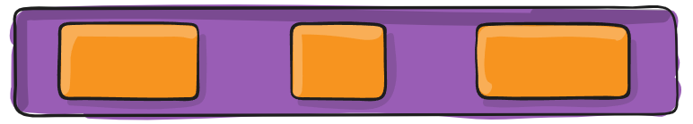

# CSS

- raw한 html 문서를 꾸며주는 역할
- 인라인 방식 : 해당 태그에 직접 style 속성을 활용


- 내부 참조 방식 : head 태그 내에 <style>에 지정


- 외부 참조 방식 : 외부 CSS 파일을 <head>내 <link>를 통해 불러오기


- 선택자

  - 요소 선택자

    - HTML 태그를 직접 선택
    - ``h2{color: orange;}``

  - class 선택자

    - 마침표(.)문자로 시작하며, 해당 클래스가 적용된 모든 항목을 선택

    ```css
    <style>
        .green{color;green;}
    </style>
    ```

  - id 선택자

    - (#) 문자로 시작하며, 해당 아이디가 적용된 모든 항목을 선택
    - 일반적으로 하나의 문서에 1번만 사용 (Unique)

    ```css
    <style>
    	#purple {color: purple;}
    </style>
    ```

  - 전체 선택자

    - *(애스터리스크)를 활용
    - ``*{color: red;}``

  - 우선순위

    - ``!important`` > 인라인 > id 선택자 > class 선택자 > 요소 선택자

- 결합자

  - 자식 결합자
    - 자기보다 하나 아래 특정 태그만 선택
    - ``.box > p { font-size: 30px;}`` : box라는 class 태그의 글씨크기를 30으로 하겠다.
  - 자손 결합자
    - 자기보다 하위의 태그를 선택 (여러개 가능)
    - ``.box p { color: blue;}`` : 들여쓰기 안에 모든 p태그가 포함 ( '>'가 아님)

```html
<body>
    <p>안녕하세요<span>김싸피</span>입니다.</p>
    <!-- 안녕하세요 김싸피 입니다. 테두리는 black -->
    <!-- border는 상속이 되지 않았으므로 김싸피만의 테두리를 blue로 하고싶으면 추가로 입력 -->
</body>
<style>
    p {
        color: red; /* 상속됨 */
        border: 1px solid black; /* 상속 안됨 */
    }
    span {
        border: 1px solid blue;
    }
</style>
```

- 크기 단위

  - px

    - 모니터 해상도의 한 화소인 '픽셀'을 기준
    - 고정단위

  - %

    - 백분율 단위
    - 가변적인 레이아웃에서 자주 사용

  - em

    - (바로 위, 부모 요소에 대한) 상속의 영향을 받음
    - 배수 단위, 요소에 지정된 사이즈에 상대적인 사이즈를 가짐

  - rem

    - (바로 위, 부모 요소에 대한) 상속의 영향을 받지 않음
    - 최상위 요소(html)의 사이즈를 기준으로 배수 단위를 가짐

    ```html
    <body>
        <ul class="em">
            <li class="em">1.5em</li>
            <li class="rem">1.5rem</li>
            <li>no class</li>
        </ul>
    </body>
    <style>
        .em {
            font-size: 1.5em;
        }
        .rem {
            font-size: 1.5rem;
        }
    </style>
    ```

    

    - em = 16 x 1.5(body의 .em) x 1.5(style의 .em)
    - rem = 16 x 1.5(body의 .em)

  - viewport

    - 웹 페이지를 방문한 유저에게 바로 보이게 되는 웹 컨텐츠의 영역
    - 주로 스마트폰이나 테블릿 디바이스의 화변을 일컫는 용어로 사용
    - 글자 그대로 디바이스의 viewport를 기준으로 상대적인 사이즈가 결정됨
    - vw, vh, vmin, vmax

- 일반 형제 결합자

  - ``~``
  - p태그 뒤에 모든 span을 red로 하려면

  ```html
  <body>
      <span>p태그의 앞에 있기 때문에 이건 빨강이 아닙니다.</span>
  	<p>여기 문단이 있습니다.</p>
  	<b>그리고 코드도 있습니다.</b>
  	<span>p태그와 형제이기 때문에 이건 빨강입니다!</span>
  	<b>더 많은 코드가 있습니다.</b>
  	<span>이것도 p태그와 형제이기 때문에 빨강입니다!</span>
  </body>
  <style>
      p ~ span {
          color: red;
      }
  </style>
  ```

- Box Model

  - margin
    - 테두리 바깥의 외부 여백 
      - 배경색을 지정할 수 없음
  - border
    - 테두리 영역
  - padding
    - 테두리 안쪽의 내부 여백
    - 요소에 적용된 배경색, 이미지는 padding까지 적용
  - content
    - 글이나 이미지 등 요소의 실제 내용
  - 순서대로 전체 > 상하/좌우 > 상/좌우/하 > 상/우/하/좌


- 마진 상쇄
  - ``margin-bottom: 50px; `` ``margin-top: 70px;``
  - 둘 간의 거리는 120px가 아닌 70px

```html
<style>
.box-sizing {
    box-sizing: border-box ;
}
</style>
```

- CSS Display

  - ``display: block``
    - 줄 바꿈이 일어나는 요소
    - 화면 크기 전체의 가로 폭을 자치
    - 블록 레벨 요소 안에 인라인 레벨 요소가 들어갈 수 있음
    - div, ul, ol, li, p, hr, form 등

  

  - ``display: inline``
    - 줄 바꿈이 일어나지 않는 행의 일부 요소
    - content 너비만큼 가로 폭을 차지
    - width, height, margin-top, margin-bottom을 지정할 수 없음
    - 상하 여백은 line-height로 지정
    - span, a, img, input, label, b, em, i, strong 등

  

  - ``display: inline-block``

    - block과 inline 레벨 요소의 특징을 모두 갖음
    - inline처럼 한 줄에 표시 가능
    - block처럼 width, height, margin 속성을 모두 지정 가능

  - display: none

    - 해당 요소를 화면에 표시하지 않음
    - 이와 비슷한 ``visibility: hidden``은 해당 요소가 공간은 차지하나 화면에 표시만 하지 않음

    ```html
    <body>
        <h1>나는 block입니다</h1>
        <div>block</div>
        <p>나는<span>인라인</span>속성입니다.</p>
        <hr>
        <h2>display none vs visibility hidden</h2>
        <div>1</div>
        <div class="none">2</div>
        <div class="hidden">3</div>
        <div>4</div>
    </body>
    <style> 
        div {
            width: 100px;
            height: 100px;
            border: 2px solid black;
            background-color: crimson;
        }
        .none {
            display: none;
        }
        .hidden {
            visibility: hidden;
        }
    </style>
    ```

    

- CSS Position

  - 문서  상에서 요소를 배치하는 방법을 지정

  - static : 모든 태그의 기본 값(기준 위치)

    - 일반적인 요소의 배치 순서에 따름(좌측 상단)
    - 부모 요소 내에서 배치될 때는 부모 요소의 위치를 기준으로 배치 됨

    

  - 아래는 좌표 프로퍼티(top, bottom, left, right)를 사용하여 이동이 가능 (음수 값도 가능)

    - relative

      - 상대 위치

        - 자기 자신의 static 위치를 기준으로 이동
        - 레이아웃에서 요소가 차지하는 공간은 static 일 때와 같음

        

    - absolute

      - 절대 위치

        - 요소를 일반적인 문서 흐름에서 제거 후 레이아웃에 공간을 차지하지 않음
        - static이 아닌 가장 가까이 있는 부모/조상 요소를 기준으로 이동 (없는 경우 body에 붙는 형태)
        - 원래 위치해 있었던 과거 위치에 있던 공간은 더 이상 존재하지 않음
        - 즉,  다른 모든 것과 별개로 독자적인 곳에 놓임

        

    - fixed

      - 고정 위치

        - 요소를 일반적인 문서 흐름에서 제거 후 레이아웃에 공간을 차지하지 않음
        - 부모요소와 관계없이 viewport를 기준으로 이동
        - 스크롤 시에도 항상 같은 곳에 위치함

        	

- Float

  - 이미지 좌, 우측 주변으로 텍스트를 둘러싸는 레이아웃을 위해 도입
  - 더 나아가 이미지가 아닌 다른 요소들에도 적용해 웹 사이트의 전체 레이아웃을 만드는데까지 발전
  - none : 기본값
  - left : 요소를 왼쪽으로 띄움
  - right : 요소를 오른쪽으로 띄움

  

  ```html
  <body>
      <div class="box left">float left</div>
      <p>lorem~</p>
  </body>
  <style>
      .box {
          width: 150px;
          height: 150px;
          border: 1px solid black;
          background-color: crimson;
          color: white;
          margin-left: 30px;
      }
      .left {
          float: left;
      }
  </style>
  ```

  

  ```html
  <body>
    <div class="clearfix">
      <div class="box1 left">div</div>
    </div>
    <div class="box2">div</div>
  </body>
  <style>
      .box1 {
        width: 150px;
        height: 150px;
        border: 1px solid black;
        background-color: crimson;
        color: white;
        text-align: center;
        line-height: 150px;
      }
  
      .box2 {
        width: 300px;
        height: 150px;
        border: 1px solid black;
        background-color: blue;
        color: white;
        text-align: center;
        line-height: 150px;
      }
  
      .left {
        float: left;
      }
  </style>
  ```

  

  - Float clear

    - 선택한 요소의 맨 마지막 자식으로 가상 요소를 하나 생성
    - 기본값은 inline
    - content 속성과 함께 짝지어, 요소에 장식용 콘텐츠를 추가할 때 사용

    ```html
    <style>
        .clearfix::after {
          content: "";
          display: block;
          clear: both;
        }
    </style>
    ```

    

- Flexbox

  - 배치방향

    - flex-direction
      - item이 쌓이는 방향 설정
      - row (default) : 주축의 방향이 왼쪽에서 오른쪽
      - row-reverse : 주축의 방향이 오른쪽에서 왼쪽
      - column : 주축의 방향이 위에서 아래
      - column-reverse : 주축의 방향이 아래에서 위

    

  - 요소

    - Flex Container (부모 요소)
      - Flex Item들이 놓여있는 영역
      - display 속성을 flex 혹은 inline-flex로 지정
    - Flex Item (자식 요소)
      - Container의 컨텐츠

    ```html
    <style>
        .flex-container {
            display: flex;
            /* dipslay: inline-flex; */
        }
    </style>
    ```

  - 축

    - main axis (메인축)

      - justify-content (메인축 기준 여러 줄 정렬)

        - flex-start

        

        - flex-end

        

        - center

        

        -  space-between

        

        -  space-around

        

        -  space-evenly

        

      

    - cross axis (교차축)

      - align-items (한 줄)

        - flex-start 
          - 요소들을 컨테이너 꼭대기에 정렬

        

        - flex-end
          - 요소들을 컨테이너 바닥에 정렬

        

        - center
          - 요소들을 컨테이너 세로선 상의 가운데로 정렬

        

        - stretch (default)
          - 요소들로 컨테이너에 맞게 꽉 채움

        

        - baseline
          - item 내부의 text에 기준선을 맞춤

        

      - align-self (개별 요소)

        - auto, flex-start, flex-end, center, baseline, stretch

      - align-content (여러 줄)

        - flex-start

          - 여러 줄들을 컨테이너 꼭대기에 정렬

          

        - flex-end

          - 여러 줄들을 컨테이너 바닥에 정렬

          

        - center

          - 여러 줄들을 세로선 상의 가운데에 정렬

          

        - stretch

          - 여러 줄들을 컨테이너에 맞게 꽉 채움

          

        - space-between

          - 여러 줄들 사이에 동일한 간격

          

        - space-around

          - 여러 줄들 주위에 동일한 간격

          

      

  - 기타

    - flex-wrap

      - 요소들이 강제로 한 줄에 배치 되게 할 것인지 여부 결정
      - nowrap (default) : 모든 아이템들 한 줄에 나타내려고 함 -> 그래서 자리가 없어도 튀어나옴
      - wrap : 넘치면 그 다음 줄에서 나타냄
      - wrap-reverse : 넘치면 그 윗줄로(역순)

      

    -  flex-flow

      - flex-direction과 flex-wrap의 shorthand
      - flex-direction과 flex-wrap에 대한 설정 값을 차례로 작성
      - ex) flex-flow: row nowrap;

    - order

      - 작은 숫자 일수록 앞(우선 쌓이는 방향)으로 이동
      - 기본값 : 0
      - 음수 가능

      

      

    - flex-grow

      - 주축에서 남는 공간을 항목들에게 분배하는 방법
      - 각 아이템의 상대적 비율을 정하는 것은 아님
      - 기본 값 : 0
      - 음수 불가능

    

  


- Grid
  - 12개의 Column과 6개의 Grid breakpoints

  

  - 연습

  ```html
  <body>
      <div class="container">
          <h2 class="text-center">column</h2>
          <div class="row">
              <div class="box col">1</div>
              <div class="box col">2</div>
              <div class="box col">3</div>
          </div>
          <hr>
          
          <div class="row">
              <div class="box col">1</div>
              <div class="box col">2</div>
              <div class="w-100"></div>
              <div class="box col">3</div>
              <div class="box col">4</div>
          </div>
          <hr>
          
          <div class="row">
              <div class="box col-3">1</div>
              <div class="box col-6">2</div>
              <div class="box col-3">3</div>
          </div>
          <hr>
          
          <div class="row">
              <div class="box col-1">1</div>
              <div class="box col-1">2</div>
              <div class="box col-1">3</div>
              <div class="box col-1">4</div>
              <div class="box col-1">5</div>
              <div class="box col-1">6</div>
              <div class="box col-1">7</div>
              <div class="box col-1">8</div>
              <div class="box col-1">9</div>
              <div class="box col-1">10</div>
              <div class="box col-1">11</div>
              <div class="box col-1">12</div>
              <div class="box col-1">13</div>            
          </div>
          <hr>
  
          <div class="row">
              <div class="box col-9">col-9</div>
              <div class="box col-4">col-4</div>
              <div class="box col-3">col-3</div>
          </div>
          <hr>
          
          <h2 class="text-center">nesting</h2>
          <div class="row">
            <div class="box col-6">
              <div class="row">
                <div class="box col-3">1</div>
                <div class="box col-3">2</div>
                <div class="box col-3">3</div>
                <div class="box col-3">4</div>
              </div>
            </div>
            <div class="box col-6">1</div>
            <div class="box col-6">2</div>
            <div class="box col-6">3</div>
          </div>
          <hr>
          
          <h2 class="text-center">offset</h2>
          <div class="row">
            <div class="box col-md-4 offset-4">.col-md-4 .offset-4</div>
            <div class="box col-md-4 offset-md-4 offset-lg-2">.col-md-4 .offset-md-4 .offset-lg-2</div>
          </div>
          <hr>
          
          <div class="row parent">
              <div class="box col-4 align-self-start">1</div>
              <div class="box col-4 align-self-center">2</div>
              <div class="box col-4 align-self-end">3</div>               
          </div>        
      </div>
  </body>
  ```

  

  


