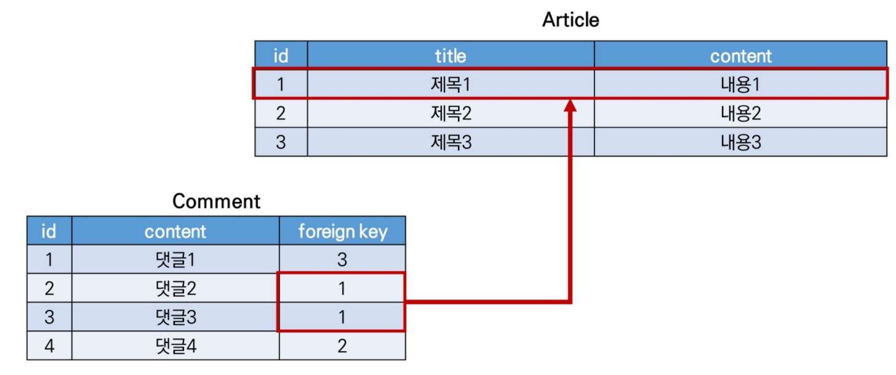
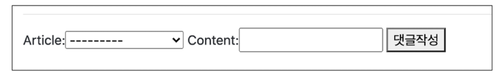
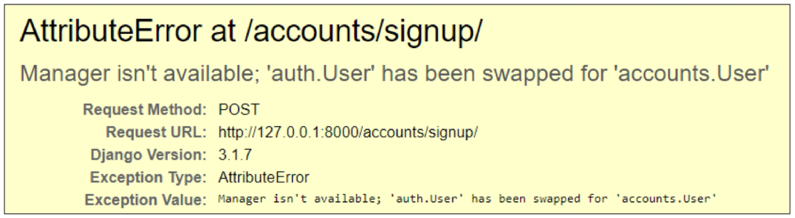
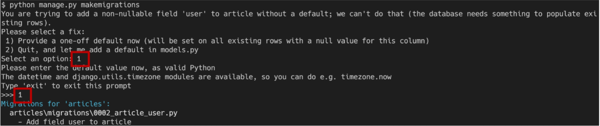
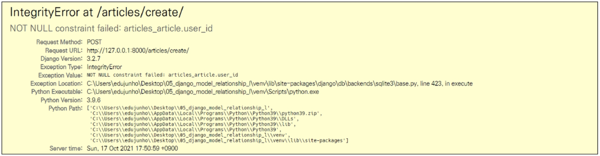
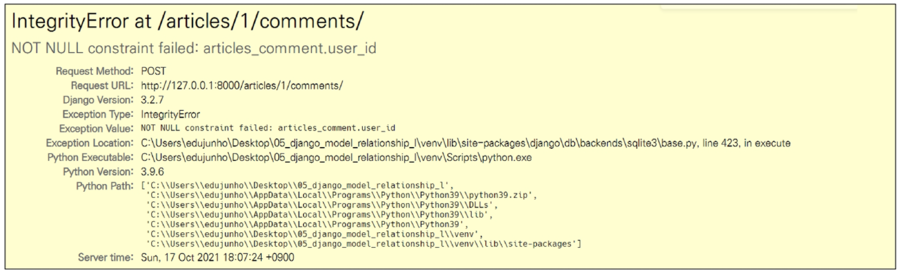

# 모델 관계


## 🔖 1 : N 관계 

- Article (1) : Comment (N)

- 첫 번째 인자는 참조하는 model class
- 두 번째 인자는 on_delete 옵션
  - 외래 키가 참조하는 객체가 사라졌을 때 외래 키를 가진 객체를 어떻게 처리할 지를 정의
    - CASCADE : 부모 객체(참조 된 객체)가 삭제 됐을 때 이를 참조하는 객체도 삭제

```python
class Comment(models.Model):
    article = models.ForeignKey(Article, on_delete=models.CASCADE)
```

- ``ForeignKeyField``는 'article_id'와 같이 생성됨.
- 역참조 (1이 N에 접근 - 'comment_set')
  - ``article.comment``가 아닌 ``article.comment_set``으로 접근 / ``dir(article)``을 통해 접근법 확인
  - 세 번째 인자에 'related_name'으로 사용할 이름을 지정할 수 있음 -> 지정 후 migration
  - ``article.comment_set``은 사용할 수 없고, ``article.comments``로 대체됨.

```python
class Comment(models.Model):
    article = models.ForeignKey(Article, on_delete=models.CASCADE, related_name='comments')
```

- 참조 (N이 1에 접근 - 'article')
  - ``comment.article``로 접근 


### 🔑 Foreign Key (외래키)

- RDB에서 한 테이블의 필드 중 다른 테이블의 행을 식별할 수 있는 키
- 참조하는 테이블에서 1개의 키는 참조되는 테이블의 기본 키(PK)를 가리킴
- 참조하는 테이블의 행 1개는 참조되는 테이블의 행 값에 대응
  - 참조하는 테이블의 행 여러개가 참조되는 테이블의 동일한 행 참조 가능



- 키를 사용하여 부모 테이블의 유일한 값을 참조 (참조 무결성)
  - 참조 무결성 - DB 관계 모델에서 관련된 2개의 테이블 간의 일관성
- 외래 키의 값이 반드시 부모 테이블의 기본 키(PK)일 필요는 없지만 유일한 값이어야 함.


### ✔ 댓글 조회

```python
# articles/views.py

def detail(request, pk):
    article = get_object_or_404(Article, pk=pk)
    comment_form = CommentForm()
    comments = article.comment_set.all()
    context = {
        'article': article,
        'comment_form': comment_form,
        'comments': comments,
    }
    return render(request, 'articles/detail.html', context)
```

- ``ForeignKeyField``를 작성자가 직접 입력하는 상황이 발생
- CommentForm에서 외래 키 필드 출력 제외

```python
# articles/forms.py

class CommentForm(forms.ModelForm):
    
    class Meta:
        model = Comment
        exclude = ('article',)
```

```html
<!-- articles/detail.html -->


<h4>댓글 목록</h4>

	<p>{{ comments|length }}개의 댓글이 있습니다.</p>

<ul>
    
    <li>댓글 작성 유저: {{ comment.user }}</li>
    <li>댓글 번호: {{ comment.pk }}</li>
    <li>댓글 내용: {{ comment.content }}</li>
    
    <p>댓글이 없습니다</p>
    
</ul>

```


### ✔ 댓글 작성

```python
# articles/urls.py

app_name = 'articles'
urlpatterns = [
    path('<int:pk>/comments/', views.comments_create, name='comments_create'),
]
```

```python
# articles/views.py

@require_POST
def comments_create(request, pk):
    article = get_object_or_404(Article, pk=pk)
    comment_form = CommentForm(request.POST)
    if comment_form.is_valid():
        comment = comment_form.save(commit=False)
        comment.article = article
        comment.save()
    return redirect('articles:detail', article.pk)
```

- ``save(commit=False)``
  - 아직 DB에 저장되지 않은 인스턴스를 반환
  - 저장하기 전에 객체에 대한 사용자 지정 처리를 수행할 때 유용하게 사용

```html
<!-- articles/detail.html -->
<!-- 댓글 작성 form -->


   <!-- -->
    <form action="" method="POST">
      
      {{ comment_form }}
      <input type="submit" value="댓글 작성">
    </form>
  
    <a href="">[댓글을 작성하려면 로그인하시오]</a>
  

```


### ✔ 댓글 삭제

```python
# articles/urls.py

urlpatterns = [
    path('<int:article_pk>/comments/<int:comment_pk>/delete/', views.comments_delete, name='comments_delete'),
]
```

```python
# articles/views.py

@require_POST
def comments_delete(request, article_pk, comment_pk):
    if request.user.is_authenticated:
        comment = get_object_or_404(Comment, pk=comment_pk)
        comment.delete()
    return redirect('articles:detail', article_pk)
```

```html
<!-- articles/detail.html -->


	<form action="" method='POST'>
        
        <input type="submit" value="DELETE">
	</form>


```


### ✔ User 모델 대체

- Django 새 프로젝트 시작 시, 커스텀 유저 모델 설정을 권장
  - 내장 User 모델이 제공하는 인증 요구사항이 적절하지 않을 수 있기 때문
    - ex) username 대신 email을 식별 토큰으로 사용하는 것이 더 적합한 사이트
- ``AUTH_USER_MODEL``
  - User를 나타내는데 사용하는 모델
  - 기본 값 : 'auth.user'
- 기존에 django가 사용하는 User 모델이었던 auth 앱의 User 모델을 accounts 앱의 User 모델을 사용하도록 변경

```python
# settings.py

AUTH_USER_MODEL = 'accounts.User'
```

```python
# accounts/models.py

form django.contrib.auth.models import AbstractUser

class User(AbstractUser):
    pass
```

```python
# accounts/admin.py

from django.contrib.auth.admin import UserAdmin
from django.contrib import admin
from .models import User

admin.site.register(User, UserAdmin)
```

- db.sqlite3 파일 삭제 및 migrations 파일 모두 삭제 (0001_initail.py ...) 후 migrate 재 진행


- 회원가입 시, 아래와 같은 에러 발생
  - UserCreationForm과 UserChangeForm은 기존 내장 User 모델을  사용한 ModelFrom이기 때문에 커스텀 User 모델로 대체해야 함



```python
# accounts/forms.py

from django.contrib.auth.forms import UserChangeForm, UserCreationForm
from django.contrib.auth import get_user_model

class CustomUserCreationForm(UserCreationForm):
    
    class Meta(UserCreationForm.Meta):
        # models.py에서  User 모델을 부르면 settings.AUTH_USER_MODEL
        # 나머지 모든 곳에서는 get_user_model()
        model = get_user_model()
        fields = UserCreationForm.Meta.fields + ('email',)
```

- 이 후, accounts/views.py의 signup함수에 ``UserCreationForm`` -> ``CustomUserCreationForm``
- ``settings.AUTH_USER_MODEL``
  - User 모델에 대한 외래 키 또는 다대다 관계를 정의할 때 사용
- ``get_user_model()``
  - 현재 활성화된 User 모델을 반환
  - 커스텀한 User 모델이 있을 경우엔 Custom User 모델, 그렇지 않으면 User를 반환

```PYTHON
# articles/models.py

form django.conf import settings

class Article(models.Model):
    user = models.ForeignKey(settings.AUTH_USER_MODEL, on_delete=models.CASCADE)
```


- makemigrations 이후 발생



- null 값이 허용되지 않는 user_id 필드가 별도의 값 없이 article에 추가되려 하기 때문
- 1 + enter -> 현재 화면에서 기본 값을 설정하겠다
- 1 + enter -> 기존 필드에 추가되는 user_id 필드의 값을 1로 설정하겠다


- 게시글 출력필드 수정 시, 다음과 같은 에러 발생



- CREATE

```python
# articles/views.py

@login_required
@require_http_methods(['GET', 'POST'])
def create(request):
    if request.method == 'POST':
        form = ArticleForm(request.POST)
        if form.is_valid():
            article = form.save(commit=False)   # commit=False 추가 - 저장 멈추고 객체 반환
            article.user = request.user         # 작성자 정보 추가  - 로그인한 유저 정보를 넣어주고
            article.save()                      # 저장 추가 - 다시 저장
            return redirect('articles:detail', article.pk)
```

- DELETE

```python
@require_POST
def delete(request, pk):
    article = get_object_or_404(Article, pk=pk)    
    if request.user.is_authenticated:
        if request.user == article.user:	# 자신이 작성한 게시글만 삭제
            article.delete()
            return redirect('articles:index')
    return redirect('articles:detail')
```

- UPDATE

```PYTHON
@login_required
@require_http_methods(['GET', 'POST'])
def update(request, pk):
    article = get_object_or_404(Article, pk=pk)
    # update 함수를 요청한 유저가 게시글을 작성한 유저와 동일한 경우에만 수정을 할 수 있도록 조건 설정
    if request.user == article.user:
        if request.method == 'POST':
            form = ArticleForm(request.POST, instance=article)
            if form.is_valid():
                form.save()
                return redirect('articles:detail', article.pk)
        else:
            form = ArticleForm(instance=article)
    else:
        return redirect('articles:index')
    context = {
        'article': article,
        'form': form,
    }
    return render(request, 'articles/update.html', context)
```

- 해당 게시글의 작성자가 아닐 경우, 수정/삭제 버튼 출력되지 않도록 처리

```html
<!-- articles/index.html -->

  
    <a href="" class="btn btn-primary">[UPDATE]</a>
    <form action="" method="POST">
      
      <button class="btn btn-danger">DELETE</button> 
    </form>
  
```


### ✔ User와 Comment 모델 관계

```python
# articles/models.py

class Comment(models.Model):
    user = models.ForeignKey(settings.AUTH_USER_MODEL, on_delete=models.CASCADE)
    article = models.ForeignKey(Article, on_delete=models.CASCADE)
```


- 아래 에러 발생 이유 : 댓글 작성 시 작성자 정보(comment.user) 누락



```python
# articles/views.py

def comments_create(request, pk):
    if request.user.is_authenticated:
        article = get_object_or_404(Article, pk=pk)
        comment_form = CommentForm(request.POST)
        if comment_form.is_valid():
            comment = comment_form.save(commit=False)   # 댓글 저장하는 시점에 어떤 게시글에 저장이 될지 설정해줌
            comment.article = article
            comment.user = request.user	# 댓글 작성 시 작성자 정보(request.user) 추가 후 댓글 작성 재시도
            comment.save()
        return redirect('articles:detail', article.pk)
    return redirect('articles:detail')
```

```python
# articles/views.py

def comments_delete(request, article_pk, comment_pk):
    if request.user.is_authenticated:
        comment = get_object_or_404(Comment, pk=comment_pk)
        if request.user == comment.user:	# 자신이 작성한 댓글만 삭제 할 수 있도록 수정
            comment.delete()
        return redirect('articles:detail', article_pk)
    return redirect('accounts:login')
```


## 🏷 M : N 관계

- 의사 (M) : 환자 (N)
- 의사에게 진찰받는 환자, 환자를 진찰하는 의사
- ``ManyToManyField``
  - ``add()``, ``remove()``를 통해 개체 추가, 제거 가능
  - symmetrical
    - ``ManyToManyField``가 동일한 모델을 가리키니는 정의에서만 사용

```python
class Doctor(models.Model):
    name = models.TextField()
    
class Patient(models.Model):
    doctors = models.ManyToManyField(Doctor, related_name='patients') # doctor1.patients.all()
    name = models.TextField()
```


### ✔ Like

```python
# articles/models.py

class Article(models.Model):
    user = models.ForeignKey(settings.AUTH_USER_MODEL, on_delete=models.CASCADE)
    """
    1:N
    article.user -> 게시글을 작성한 유저
    user.article_set -> 유저가 작성한 게시글 목록

    M:N
    article.like_users -> 게시글에 좋아요를 누른 유저
    user.article_set -> 유저가 좋아요를 누른 게시글 -> 이게 문제! -> 이름이 겹친다! -> related_name을 통해 변경 필요! -> user.like_articles
    """

    like_users = models.ManyToManyField(settings.AUTH_USER_MODEL, related_name='like_articles')
```

```python
# articles/urls.py

urlpatterns = [
    path('<int:article_pk>/likes/', views.likes, name='likes'),
]
```

```python
# articles/views.py

@require_POST
def likes(request, article_pk):
    if request.user.is_authenticated:
        article = get_object_or_404(Article, pk=article_pk)
        if article.like_users.filter(pk=request.user.pk).exists():	# exists()-쿼리셋에 포함되어 있으면 True, 그렇지 않으면 False
            article.like_users.remove(request.user)
        else:
            article.like_users.add(request.user)
        return redirect('articles:index')
    return redirect('accounts:login')
```

```html
<!-- articles/index.html -->

  
    <p>좋아요 수: {{ article.like_users.all|length }}</p>
    <div>
      <form action="" method='POST'>
        
        
           <input type="submit" value='좋아요 취소'> 
          <button class='btn btn-link'>
            <i class="fas fa-heart" style='color: crimson;'></i>
          </button>
        
           <input type="submit" value='좋아요'> 
          <button class='btn btn-link'>
            <i class="far fa-heart" style='color: black;'></i>          
          </button>
        
      </form>
    </div>
  
```


### ✔ Profile 

```python
# accounts/urls.py

urlpatterns = [
    path('<username>/', views.profile, name='profile'),
]
```

```python
# accounts/views.py

def profile(request, username):
    person = get_object_or_404(get_user_model(), username=username)
    context = {
        'person': person,
    }

    return render(request, 'accounts/profile.html', context)
```

```html
<!-- accounts/profile.html -->



  <h1>{{ person.username }}의 프로필 페이지</h1>
  <hr>

  <h2>{{ person.username }}의 팔로우</h2>
    
  <p>팔로잉: {{ person.followings.all|length }}</p>
  <p>팔로워: {{ person.followers.all|length }}</p>

   
  request.user -> 나
  person -> 너
  
  <div>
    
      <div>
        <form action="" method='POST'>
          
           request.user ==> me 
          
            <button>언팔로우</button>
          
            <button>팔로우</button>
              
        </form>
      </div>
      
  </div>

  <h2>{{ person.username }}이 작성한 게시글</h2>
   
  person(user) -> 1
  article -> N

  1이 N을 직접 가져올 수 없기 때문에 _set을 사용
  
  
    <p>{{ article.pk }}</p>
    <p>{{ article.title }}</p>
  
  <hr>

  <h2>{{ person.username }}이 작성한 댓글</h2>
  
    <p>{{ comment.pk }}</p>  
    <p>{{ comment.content }}</p>  
  

  <h2>{{ person.username }}이 좋아요를 누른 게시글</h2>
  
    <p>{{ article.pk }}</p>
    <p>{{ article.title }}</p>
  

  <a href="">뒤로가기</a>

```

```html
<!-- base.html -->

<body>
  <div class="container">
    
      <h3>Hello, {{ user }}</h3>
      <a href="">유저 프로필</a>
    
      <a href="">Login</a>
      <a href="">Signup</a>
    
```

```html
<!-- articles/index.html -->
<p>
    <b>작성자 : <a href="">{{ article.user }}</a></b>
</p>
```


### ✔ follow

```python
# accounts/models.py

from django.db import models
from django.contrib.auth.models import AbstractUser

class User(AbstractUser):
    followings = models.ManyToManyField('self', symmetrical=False, related_name='followers')
```

```python
# accounts/urls.py

urlpatterns = [
    path('<int:user_pk>/follow/', views.follow, name='follow'),
]
```

```python
# accounts/views.py

@require_POST
def follow(request, user_pk):
    if request.user.is_authenticated:
        you = get_object_or_404(get_user_model(), pk=user_pk)
        me = request.user
        if you != me:
            if you.followers.filter(pk=request.user.pk).exists():
                you.followers.remove(me)    # 언팔
            else:
                you.followers.add(me)       # 팔로우
        return redirect('accounts:profile', you.username)

    return redirect('accounts:login')
```

```html

  <p>팔로잉: {{ person.followings.all|length }}</p>
  <p>팔로워: {{ person.followers.all|length }}</p>

   
  request.user -> 나
  person -> 너
  
  <div>
    
      <div>
        <form action="" method='POST'>
          
           request.user ==> me 
          
            <button>언팔로우</button>
          
            <button>팔로우</button>
              
        </form>
      </div>
      
  </div>

```

