# Web

## ✏ html

- 웹 페이지가 어떻게 구조화되었는지 알 수 있도록 하는 마크업 언어

```html
<!DOCTYPE html> 
<html lang='ko'>
<head>
	<meta charset='UTF-8'>
    <title>Document</title>
</head>
<body>
	<!-- 우리가 보는 곳임''' -->
</body>
</html>
```

- html 요소
  - HTML문서의 최상위 요소로 문서의 root. <head>와 <body> 부분으로 구분됨
  - head 요소
    - 문서 제목, 문자코드(인코딩)와 같이 해당 문서 정보를 담고 있으며, 브라우저에 나타나지 않음
    - CSS 선언 혹은 외부 로딩 파일 지정 등도 작성
  - body 요소
    - 브라우저 화면에 나타나는 정보로 실제 내용에 해당
- 관습
  - 각 탭마다 2칸 띄어쓰기
  - ' '가 아닌, " " 사용하기

```html
<body>
    <h1>웹문서</h1>
    <ul>
        <li>HTML</li>
        <li>CSS</li>
    </ul>
</body>
```

- DOM
  - 문서의 구조화된 표현을 제공, 프로그래밍 언어가 DOM 구조에 접근할 수 있는 방법을 제공하여 그들이 문서 구조, 스타일 내용 등을 변경 할 수 있게 도움
  - DOM은 동일한 문서를 표현하고, 저장하고, 조작하는 방법을 제공
  - Web Page의 객체 지향 표현
- 요소
  - HTML요소는 시작태그와 종료태그 그리고 태그 사이에 위치한 내용으로 구성
  - 태그는 컨텐츠(내용)을 감싸는 것으로 그 정보의 성격과 의미를 정의
  - 요소는 중첩이 가능하다.
    - 시작태그와 종료태그의 쌍을 잘 확인해야함
      - 오류반환이 아닌 레이아웃이 깨진 상태로 출력되기 때문에 디버깅이 힘들어질 수 있음
- 속성
  - 요소는 속성을 가질 수 있으며, 경로나 크기와 같은 추가적인 정보 제공
  - ``<div class="container">``, ``<ul style="width: 50px;">``..
- 내용이 없는 태그들
  - br, hr, img, input, link, meta
- 시멘틱 태그
  - header : 문서 전체나 섹션의 헤더
  - nav : 내비게이션
  - aside : 사이드에 위치한 공간, 메인 콘텐츠와 관련성이 적은 콘텐츠
  - section : 문서의 일반적인 구분, 컨텐츠의 그룹을 표현
  - article : 문서, 페이지, 사이트 안에서 독립적으로 구분되는 영역
  - footer : 문서 전체나 섹션의 푸터(마지막 부분)
  - div
    - 텍스트를 그룹화
    - 블럭 요소 - 전체 넓이를 모두 차지
  - span
    - 인라인 요소 - 텍스트만큼의 넓이를 차지
  - p
    - 문단
  - hr
    - 헤드라인
    - 밑줄
  - pre, block
    - 주석
  - a
    - 하이퍼 텍스트 링크 만들어줌
  - strong 
    - 굵은 표시(강조를 의미)
  - form
    - 사용자가 입력한 정보를 서버로 보내주는 태그
    - ex) id, pw
    - action
      - 해당 정보를 어디로 보낼지 결정
    - input
      - 입력하는 곳
      - name, placeholder, required, autofocus


## 🖌 CSS

- raw한 html 문서를 꾸며주는 역할
- 인라인 방식 : 해당 태그에 직접 style 속성을 활용

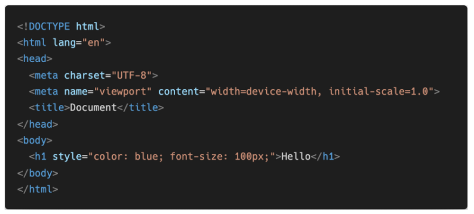

- 내부 참조 방식 : head 태그 내에 <style>에 지정


- 외부 참조 방식 : 외부 CSS 파일을 <head>내 <link>를 통해 불러오기

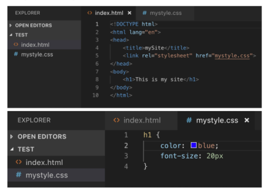

- 선택자

  - 요소 선택자

    - HTML 태그를 직접 선택
    - ``h2{color: orange;}``

  - class 선택자

    - 마침표(.)문자로 시작하며, 해당 클래스가 적용된 모든 항목을 선택

    ```css
    <style>
        .green{color;green;}
    </style>
    ```

  - id 선택자

    - (#) 문자로 시작하며, 해당 아이디가 적용된 모든 항목을 선택
    - 일반적으로 하나의 문서에 1번만 사용 (Unique)

    ```css
    <style>
    	#purple {color: purple;}
    </style>
    ```

  - 전체 선택자

    - *(애스터리스크)를 활용
    - ``*{color: red;}``

  - 우선순위

    - ``!important`` > 인라인 > id 선택자 > class 선택자 > 요소 선택자

- 결합자

  - 자식 결합자
    - 자기보다 하나 아래 특정 태그만 선택
    - ``.box > p { font-size: 30px;}`` : box라는 class 태그의 글씨크기를 30으로 하겠다.
  - 자손 결합자
    - 자기보다 하위의 태그를 선택 (여러개 가능)
    - ``.box p { color: blue;}`` : 들여쓰기 안에 모든 p태그가 포함 ( '>'가 아님)

```html
<body>
    <p>안녕하세요<span>김싸피</span>입니다.</p>
    <!-- 안녕하세요 김싸피 입니다. 테두리는 black -->
    <!-- border는 상속이 되지 않았으므로 김싸피만의 테두리를 blue로 하고싶으면 추가로 입력 -->
</body>
<style>
    p {
        color: red; /* 상속됨 */
        border: 1px solid black; /* 상속 안됨 */
    }
    span {
        border: 1px solid blue;
    }
</style>
```

- 크기 단위

  - px

    - 모니터 해상도의 한 화소인 '픽셀'을 기준
    - 고정단위

  - %

    - 백분율 단위
    - 가변적인 레이아웃에서 자주 사용

  - em

    - (바로 위, 부모 요소에 대한) 상속의 영향을 받음
    - 배수 단위, 요소에 지정된 사이즈에 상대적인 사이즈를 가짐

  - rem

    - (바로 위, 부모 요소에 대한) 상속의 영향을 받지 않음
    - 최상위 요소(html)의 사이즈를 기준으로 배수 단위를 가짐

    ```html
    <body>
        <ul class="em">
            <li class="em">1.5em</li>
            <li class="rem">1.5rem</li>
            <li>no class</li>
        </ul>
    </body>
    <style>
        .em {
            font-size: 1.5em;
        }
        .rem {
            font-size: 1.5rem;
        }
    </style>
    ```

    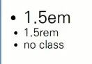

    - em = 16 x 1.5(body의 .em) x 1.5(style의 .em)
    - rem = 16 x 1.5(body의 .em)

  - viewport

    - 웹 페이지를 방문한 유저에게 바로 보이게 되는 웹 컨텐츠의 영역
    - 주로 스마트폰이나 테블릿 디바이스의 화변을 일컫는 용어로 사용
    - 글자 그대로 디바이스의 viewport를 기준으로 상대적인 사이즈가 결정됨
    - vw, vh, vmin, vmax

- 일반 형제 결합자 

  - ``~``
  - p태그 뒤에 모든 span을 red로 하려면

  ```html
  <body>
      <span>p태그의 앞에 있기 때문에 이건 빨강이 아닙니다.</span>
  	<p>여기 문단이 있습니다.</p>
  	<b>그리고 코드도 있습니다.</b>
  	<span>p태그와 형제이기 때문에 이건 빨강입니다!</span>
  	<b>더 많은 코드가 있습니다.</b>
  	<span>이것도 p태그와 형제이기 때문에 빨강입니다!</span>
  </body>
  <style>
      p ~ span {
          color: red;
      }
  </style>
  ```

- Box Model

  - margin
    - 테두리 바깥의 외부 여백 
      - 배경색을 지정할 수 없음
  - border
    - 테두리 영역
  - padding
    - 테두리 안쪽의 내부 여백
    - 요소에 적용된 배경색, 이미지는 padding까지 적용
  - content
    - 글이나 이미지 등 요소의 실제 내용
  - 순서대로 전체 > 상하/좌우 > 상/좌우/하 > 상/우/하/좌

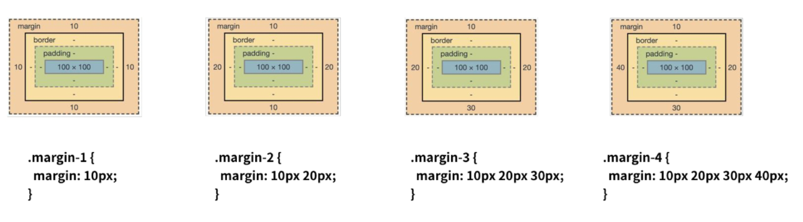

- 마진 상쇄
  - ``margin-bottom: 50px; `` ``margin-top: 70px;``
  - 둘 간의 거리는 120px가 아닌 70px

```css
<style>
.box-sizing {
    box-sizing: border-box ;
}
</style>
```


- CSS Display

  - ``display: block``

    - 줄 바꿈이 일어나는 요소
    - 화면 크기 전체의 가로 폭을 자치
    - 블록 레벨 요소 안에 인라인 레벨 요소가 들어갈 수 있음
    - div, ul, ol, li, p, hr, form 등

    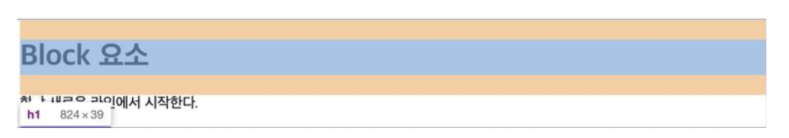

    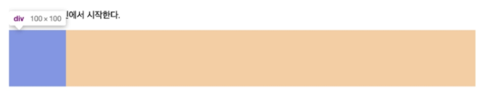

  - ``display: inline``

    - 줄 바꿈이 일어나지 않는 행의 일부 요소
    - content 너비만큼 가로 폭을 차지
    - width, height, margin-top, margin-bottom을 지정할 수 없음
    - 상하 여백은 line-height로 지정
    - span, a, img, input, label, b, em, i, strong 등

    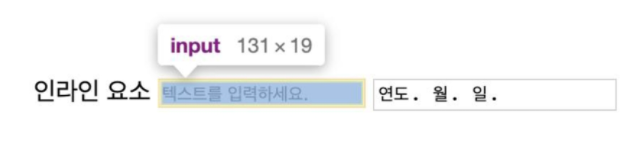

  - ``display: inline-block``

    - block과 inline 레벨 요소의 특징을 모두 갖음
    - inline처럼 한 줄에 표시 가능
    - block처럼 width, height, margin 속성을 모두 지정 가능

  - display: none

    - 해당 요소를 화면에 표시하지 않음
    - 이와 비슷한 ``visibility: hidden``은 해당 요소가 공간은 차지하나 화면에 표시만 하지 않음

    ```html
    <body>
        <h1>나는 block입니다</h1>
        <div>block</div>
        <p>나는<span>인라인</span>속성입니다.</p>
        <hr>
        <h2>display none vs visibility hidden</h2>
        <div>1</div>
        <div class="none">2</div>
        <div class="hidden">3</div>
        <div>4</div>
    </body>
    <style> 
        div {
            width: 100px;
            height: 100px;
            border: 2px solid black;
            background-color: crimson;
        }
        .none {
            display: none;
        }
        .hidden {
            visibility: hidden;
        }
    </style>
    ```

    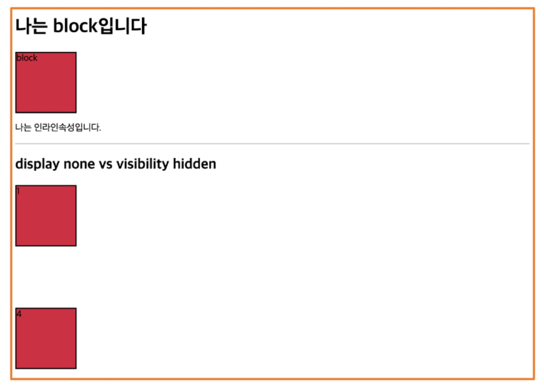

- CSS Position

  - 문서  상에서 요소를 배치하는 방법을 지정

  - static : 모든 태그의 기본 값(기준 위치)

    - 일반적인 요소의 배치 순서에 따름(좌측 상단)
    - 부모 요소 내에서 배치될 때는 부모 요소의 위치를 기준으로 배치 됨

    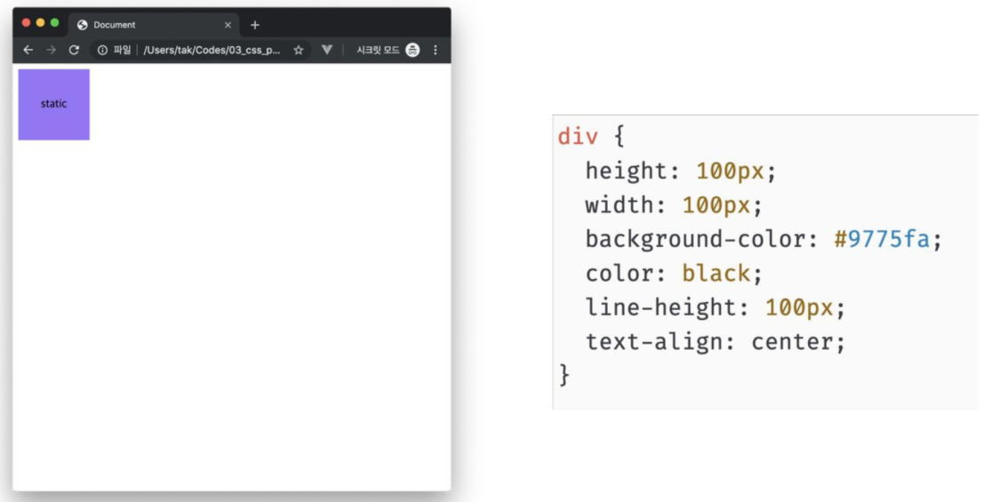

  - 아래는 좌표 프로퍼티(top, bottom, left, right)를 사용하여 이동이 가능 (음수 값도 가능)

    - relative

      - 상대 위치

        - 자기 자신의 static 위치를 기준으로 이동
        - 레이아웃에서 요소가 차지하는 공간은 static 일 때와 같음

        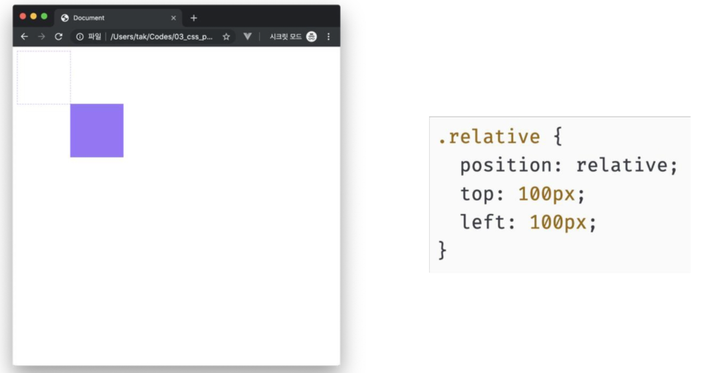

    - absolute

      - 절대 위치

        - 요소를 일반적인 문서 흐름에서 제거 후 레이아웃에 공간을 차지하지 않음
        - static이 아닌 가장 가까이 있는 부모/조상 요소를 기준으로 이동 (없는 경우 body에 붙는 형태)
        - 원래 위치해 있었던 과거 위치에 있던 공간은 더 이상 존재하지 않음
        - 즉,  다른 모든 것과 별개로 독자적인 곳에 놓임

        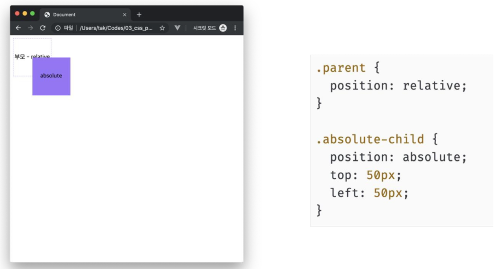

    - fixed

      - 고정 위치

        - 요소를 일반적인 문서 흐름에서 제거 후 레이아웃에 공간을 차지하지 않음
        - 부모요소와 관계없이 viewport를 기준으로 이동
        - 스크롤 시에도 항상 같은 곳에 위치함

        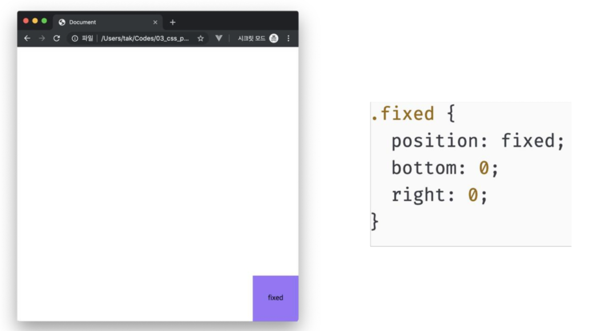

- Float

- Flexbox

- Grid

  - 12개의 Column과 6개의 Grid breakpoints
